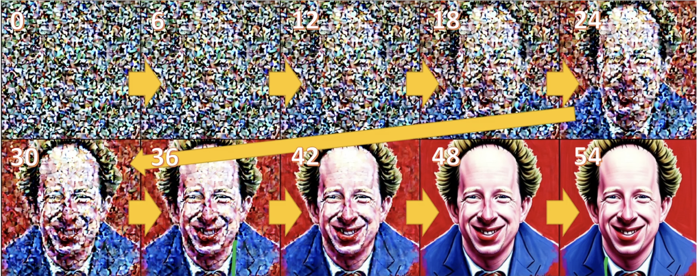

# Lesson10 : Diffusers pipeline 

## 0. Last lecture's keyword 

### Unet -> predict which pixcels are noise 
### how to embedding text -> CLIP Embeddings to text encoder 

## 1. Progressive Distillation for fast sampling 

### 1. What is Distillation? 
> Basic idea is there are teacher network and student network 

> Student network trying to do same thing what teacher networks do with less memory or less step 

### 2. how it works? 

- how can student network follows teacher network 

    > if we have teacher network that has ouput like this picture in step by step 

    > what if we train a new model called "student" and the student network input image that teacher's output at step 36 

    > and comparing(compute MSE Loss) the student output with teachers output at step 54(out goal) 

    > also we can create new student network called "student2" 

    > and follow student model as a teacher network in the same way then we can skip a lot of step 

## 2. Diffusers Pipeline 

- Start Loading all the module that we need for pre-trained weights
- first we need text encoder and tokenizer (come from text portion of standard CLIP model)

### 1. Load module 
- Text encoder and tokenizer module 
```
from transformers import CLIPTextModel, CLIPTokenizer

tokenizer = CLIPTokenizer.from_pretrained("openai/clip-vit-large-patch14", torch_dtype=torch.float16)

text_encoder = CLIPTextModel.from_pretrained("openai/clip-vit-large-patch14", torch_dtype=torch.float16).to("cuda")
```
- VAE and Unet 

```
from diffusers import AutoencoderKL, UNet2DConditionModel

# Here we use a different VAE to the original release, which has been fine-tuned for more steps
vae = AutoencoderKL.from_pretrained("stabilityai/sd-vae-ft-ema", torch_dtype=torch.float16).to("cuda")
unet = UNet2DConditionModel.from_pretrained("CompVis/stable-diffusion-v1-4", subfolder="unet", torch_dtype=torch.float16).to("cuda")
```
- scheduler 
```
from diffusers import LMSDiscreteScheduler

scheduler = LMSDiscreteScheduler(beta_start=beta_start, beta_end=beta_end, beta_schedule="scaled_linear", num_train_timesteps=1000)
```

- define parameter that we will use for generation 
```
prompt = ["a photograph of an astronaut riding a horse"]

height = 512
width = 512
num_inference_steps = 70
guidance_scale = 7.5
batch_size = 1
```

- tokenize the prompt
> We tokenize the prompt. The model requires the same number of tokens for every prompt, so padding is used to ensure we meet the required length.
```
text_input = tokenizer(prompt, padding="max_length", max_length=tokenizer.model_max_length, truncation=True, return_tensors="pt")
text_input['input_ids']
```

```
tokenizer.decode(49407)
```

- The attention mask uses zero to represent tokens we are not interested in. These are all of the padding tokens.
```
text_input['attention_mask']
```

- text encoder give us the embeddings for the text prompt
```
text_embeddings = text_encoder(text_input.input_ids.to("cuda"))[0].half()
text_embeddings.shape
```

- For classifier-free guidance 
> We also get the embeddings required to perform unconditional generation, which is achieved with an empty string: the model is free to go in whichever direction it wants as long as it results in a reasonably-looking image. These embeddings will be applied to apply classifier-free guidance.
```
max_length = text_input.input_ids.shape[-1]
uncond_input = tokenizer(
    [""] * batch_size, padding="max_length", max_length=max_length, return_tensors="pt"
)
uncond_embeddings = text_encoder(uncond_input.input_ids.to("cuda"))[0].half()
uncond_embeddings.shape
```

- For clssifier-free guidance we need to do two forward pass 
> One with the conditioned input (`text_embeddings`), and another with the unconditional embeddings (`uncond_embeddings`). In practice, we can concatenate both into a single batch to avoid doing two forward passes.
```
text_embeddings = torch.cat([uncond_embeddings, text_embeddings])

```

- Start denoising process we start from pure Gaussian noise 
> these are our initial latents
```
torch.manual_seed(100)
latents = torch.randn((batch_size, unet.in_channels, height // 8, width // 8))
latents = latents.to("cuda").half()
latents.shape
```
- initialize the scheduler
> `4×64×64` is the input shape. The decoder will later transform this latent representation into a `3×512×512` image after the denoising process is complete.

Next, we initialize the scheduler with our chosen `num_inference_steps`. This will prepare the internal state to be used during denoising.

```
scheduler.set_timesteps(num_inference_steps)

# scale the initial noise by standard deviation 
latents = latents * scheduler.init_noise_sigma

scheduler.timesteps
scheduler.sigmas

plt.plot(scheduler.timesteps, scheduler.sigmas[:-1]);
```

- 
```
from tqdm.auto import tqdm

for i, t in enumerate(tqdm(scheduler.timesteps)):
    input = torch.cat([latents] * 2)
    input = scheduler.scale_model_input(input, t)

    # predict the noise residual
    with torch.no_grad(): pred = unet(input, t, encoder_hidden_states=text_embeddings).sample

    # perform guidance
    pred_uncond, pred_text = pred.chunk(2)
    pred = pred_uncond + guidance_scale * (pred_text - pred_uncond)

    # compute the "previous" noisy sample
    latents = scheduler.step(pred, t, latents).prev_sample
```
> After this process complets our `latents` contain the denoised representation of the image. We use the `vae` decoder to convert it back to pixel space.

```
with torch.no_grad(): image = vae.decode(1 / 0.18215 * latents).sample

# finally let's convert the image to PIL 
image = (image / 2 + 0.5).clamp(0, 1)
image = image[0].detach().cpu().permute(1, 2, 0).numpy()
image = (image * 255).round().astype("uint8")
Image.fromarray(image)

```