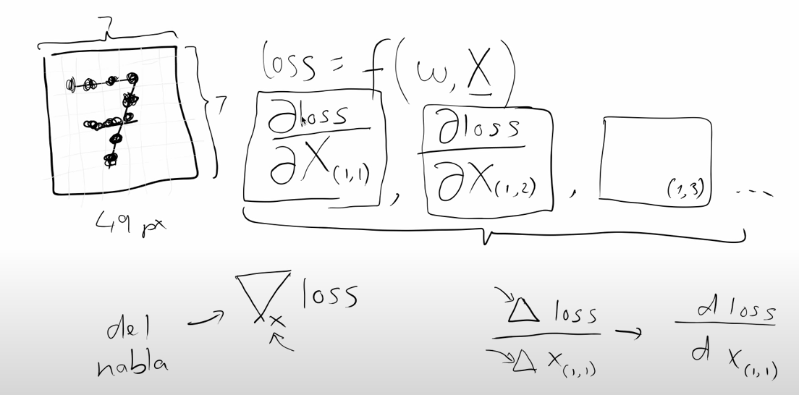
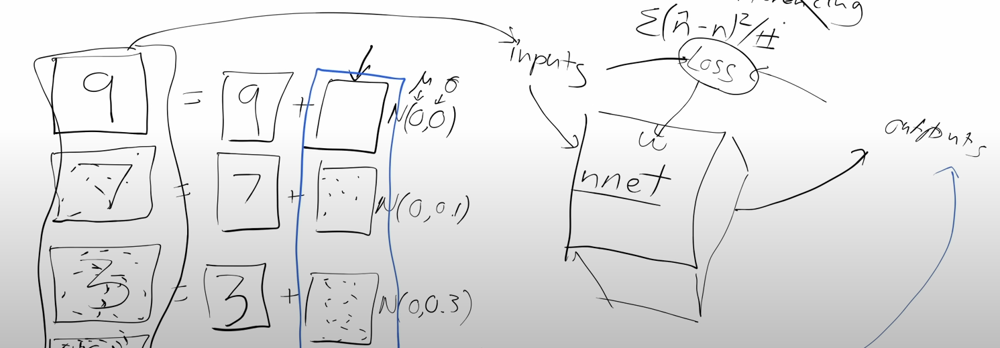
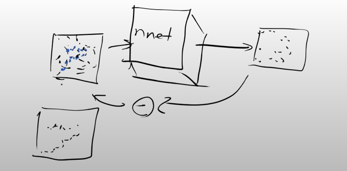
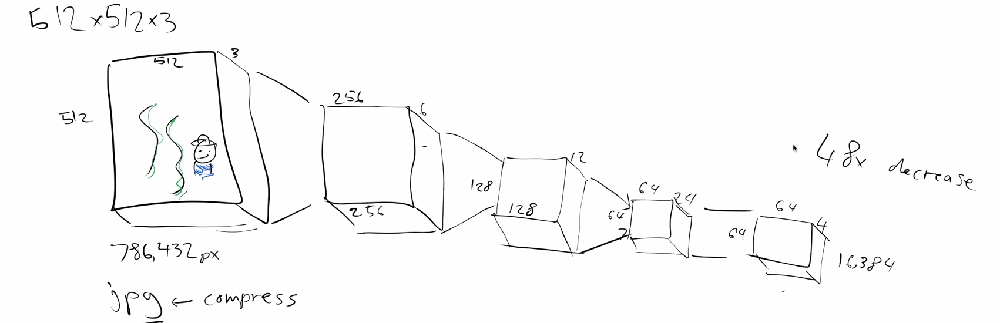
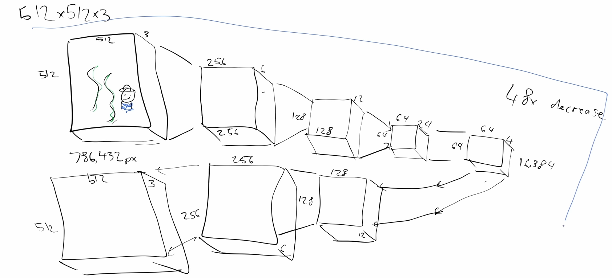

# Lesson9 Stable Diffusion

## Keyward of this lecture 

```
- CLIP embeddings
- The VAE (variational autoencoder)
- Predicting noise with the unet
- Removing noise with schedulers
```

## Deep learning foundation to stable diffusion

### Free or not free GPU site 
1. Colab (free)
2. Paperspacesgradient(sould pay)
3. lambda lab(recently service, should pay)

### Wonderful web about generative art collection [Lexica](https://lexica.art/)
- you can search image that generated by AI 
- you can check what prompt that make image 

### Diffusers of hugging face: library for doing stable diffusion 

### how to use stable diffusion model in hugging face
- login huggingface 
```
from huggingface_hub import notebook_login
from diffuesers import StableDiffusionPipeline

```
- making prompt what do you want to make? 
```
prompt = 'describe something you want to create images'
image = pipe(prompt, guidance_scale = <scale parameter>)
```

### what is the guidance_scale? 
- acutally model generate two images 
    1. image based on your prompt 
    2. image based on random thing
    - and the model takes average with two images 
- guidance_scale plays the weight of two images before taking a average 
> if you set guidance_scale 14 then model generate image based your prompt strongly <br>
> if you set guidance_scale 1 or 1.5 then model generate image based your prompt little bit 

### Negative prompt 
```
prompt = 'something'
pipe(prompt).images[]

pipe(prompt, negative_prompt = 'something that you don't want incloud the images')

```
- if you set negative_prompt = 'blue' then the image are non_blue images 


### image2image pipeline 
```
pipei2i()
```
- you can create what you want based on your input images 
- also you can make style transform 

### Fine tuning 
- how ?? 
### Texture Inversion 
- you can create any style if you have a token of the style 

### Dream booth


## What is Stable Diffusion 

### How it works? 
- Let's think the hand written digit classifier function $f$
> let image data $x1,x2,x3$ and we pass the image into $f$
<br>and function $f$ output, for example : $$p(x_1) = 0.98,p(x_2)=0.4,p(x_3)=0.02$$

- The most interesting thing is we can create new image with the classifier function $f$ 

- if 28x28 images 784 pixcel, if we modify one pixcel of the image little bit more like handwritten digit -> then $p(x_3)$ will increase little 

- again modify one pixcel -> probability goes up ! 

- like this way we can calculate the gradient $p(x_3)$ of $x_3$ to every pixcel 

"The matrix calculus you Need for deep learning" paper 2018 Parr 
 



- with those 784 values they tell us how can we change $x_3$ to make it look more like a digit 
- so what we can do is we can now change the pixcels according to this gradients 
- we can do changing the inputs values instead of changing the weights in a model 
- this is basic idea 

> if we have this function $f$ we can use it to turn any arbitrary noisy input into something that looks like a valid input, something that has a high P value

```
as i change the input pixcels how does it change the probability that this is a digit?? And that tells me which pixcels to make darker and which pixcels to make lighter? 
```
- the problem is nobody provide $f$ for us 


- we can make function $f$ 


> training model with noisy digit image but noisy digit image can devide into clear digit image + noise  <br> 

> if we training noisy digit image to predict what is the pure noise in this image  then we can create more like digit from noise 



> input : somewhat noisy image <br>
> output : the noise 

### how to do it with efficient way? 

- 512x512x3 images 
> how can compress the image? 
<br>

- using convolution network 
> stride 2 convolution layer -> ... then we can draw the CNN like this 


- then how can we get the image back again ?? 
> use inverse convolution like U-Net structure (but not a U-net)


- think this model, it is actually called "autoencoder" 
> upside structure called "encoder", downside structure called "decoder" 

- so how we can input the compressed image to our function $f$? 
> we are gonna use encoded image by 'encoder' and inject noise <br>
then we can create the input(noisy encoded image) for function $f$ 

> encoded image called "latents" 

- so with this autoencoder 
> input : somewhat noisy latents <br>
output : the noise 

> somewhat noisy latents - the noise(predicted) -> latent 

> pass this into decoder then <br>
input : small latents tensor <br>
output : large image 

> these kind of autoencoder called name "VAE" 

### how model can understand text like "A cute teddy bear"

- we need two encoder 
    1. text encoder  -> encoded vector
    2. image encoder -> encoded image 
